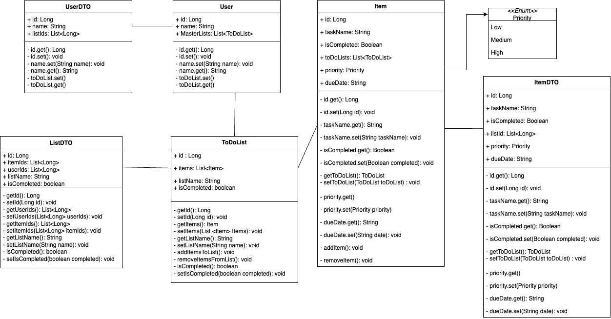

# ToDo-OrNot-ToDo - "Better than Notion"

<<<<<<< HEAD
## Summary:
This project outlines the backend code of a to-do list, designed to be used for everyday activities.
The languages and technologies that we used are: Java, Spring Boot, postgreSQL, IntelliJ, PostMan and Postico.

## Description:
=======
### Summary:
This project outlines the backend code of a to-do list, designed to be used for everyday activities. By using our API you can manage every type of tasks in your daily lives.

### Project Description:
>>>>>>> a3e31ab40c713a41f0eb68ea512b026b055c395d
This application will allow a user to create a list and populate their list with items that they need to complete.

## Diagrams:
### UML diagram: 

### ERD diagram:

### Dummy data:

## Relationships
There are one-to-many and many-to-many relationships:
* Many users to many lists
* One list to many items

## Tech Stack
- IntelliJ IDEA (JDK 17)
- PostgresSQL
- Postico
- Postman
- Spring Boot

## SetUp Instructions
Users of the application will need the following:
1. IntelliJ - with Maven and Java17
   - IntelliJ will need following dependencies to run the application:
     - Spring Data JPA
     - Spring Boot DevTools
     - Spring Web
   - Postman
   - Postico
2. Cloning the repo...

## Running our To-Do List application:
* In your computer terminal, run the following line: `createdb todolist_db`
  * In resources.application.properties, copy in the following:
    * `spring.datasource.url=jdbc:postgresql://localhost:5432/todolist_db` 
      `spring.datasource.username=` 
      `spring.datasource.password=` 
      `spring.datasource.driver-class-name=org.postgresql.Driver` 
      `spring.jpa.hibernate.ddl-auto=create-drop` 
      `spring.jpa.properties.hibernate.enable_lazy_load_no_trans=true` 
* Once you have installed all the necessary applications and dependencies for this project, run the application on IntelliJ and ensure there are no errors.
* In Postico, check that the database has been populated, according to the data created in the DataLoader.
* You can now send the following requests in Postman, working in the `localhost:8080` port:

| Action                               | Request type | Request Path                                    | Request Body Required and Example Request Bodies                                                                               | Expected return from Postman                                                                                                                                                                                                                |    
|--------------------------------------|--------------|-------------------------------------------------|--------------------------------------------------------------------------------------------------------------------------------|---------------------------------------------------------------------------------------------------------------------------------------------------------------------------------------------------------------------------------------------|
| GetAllLists                          | Get          | `/lists`                                        |                                                                                                                                | This endpoint should return all the lists from the dataloader, including the users, that own that list, and the items included in that list.                                                                                                |
| FilteringListsByCompletion           | Get          | `/lists?completed={Boolean}`                    |                                                                                                                                | This endpoint should return the lists based on whether they are completed or not, i.e. if the endpoint is `completed=true`, Postman will return all the lists which have been completed.                                                    |
| GetListById                          | Get          | `/lists/{id}`                                   |                                                                                                                                | This endpoint should return the list of the ID that has been passed in, with the items contained in that list and the users who own that list.                                                                                              |
| CreateNewList                        | Post         | `/lists`                                        | ✅ :   `{"listName" : "Gifts",`  `"isCompleted" : "false",`  `"itemIds" : [2],`  `"userIds" : [1]}`             | This endpoint should post a new item, which can be viewed either in Postico, or using the GetAllLists or GetListsByID endpoints.                                                                                                            |
| UpdateList                           | Patch        | `/lists/{id}`                                   | ✅ :   `{"listName" : "Gifts",`  `"isCompleted" : "false",`  `"itemIds" : [2],`  `"userIds" : [1]}`             | This endpoint should allow you to update a property of a specific list, and this change can be viewed in Postico or using the GetAllLists or GetListById endpoints.                                                                         |                                   |                                                                                                         |
| SetListCompletion                    | Patch        | `/lists/complete/{id}?completed={Boolean}`      |                                                                                                                                | This endpoint should allow you to update the isComplete property of a to-do list, and this change can be viewed through Postico or the following endpoints; GetAllLists, GetListById or FilteringListsByCompletion.                         |
| DeleteList                           | Delete       | `/lists/{id}`                                   |                                                                                                                                | This endpoint should allow you to delete a list, based on the ID, which can be viewed in Postico or using the GetAllLists or GetListById endpoints.                                                                                         |
| GetAllItems                          | Get          | `/items`                                        |                                                                                                                                | This endpoint should return all the items from the dataloader, including the to-do list they are in and the users who own those lists.                                                                                                      |
| FilteringItemsByPriorityOrCompletion | Get          | `items?completed={Boolean}&priority={Priority}` |                                                                                                                                | This endpoint should return items based on their completion status and their priority i.e. if the endpoint is `completed=true` and `priority=HIGH`, Postman will return all the items which have been completed and are of `HIGH` priority. |
| GetItemsByID                         | Get          | `/items/{id}`                                   |                                                                                                                                | This endpoint should return the item based on their ID, including the to-do list they are in and the users who own those lists.                                                                                                             |
| CreateNewItem                        | Post         | `/items`                                        | ✅ :    `{"taskName" : "eggs",`  ` "dueDate" : "2022-06-23",`   `"priority": "HIGH",`  `"isCompleted" : false}` | This endpoint should allow you to post a new item, which can be viewed either in Postico, or using the GetAllItems or GetItemsByID endpoints.                                                                                               |
| UpdateItem                           | Patch        | `/items/update/{id}`                            | ✅ :    `{"taskName" : "eggs",`  ` "dueDate" : "2022-06-23",`   `"priority": "HIGH",`  `"isCompleted" : false}` | This endpoint should allow you to update a property of a specific item, and this change can be viewed in Postico or using the GetAllItems or GetItemById endpoints.                                                                         |                               |                                                                                                         |
| SetItemCompletion                    | Patch        | `/items/{id}?completed=true`                    |                                                                                                                                | This endpoint should allow you to update the isComplete property of an item, and this change can be viewed through Postico or the following endpoints; GetAllItems, GetItemById or FilteringItemsByPriorityOrCompletion.                    |
| DeleteItem                           | Delete       | `/items/{id}`                                   |                                                                                                                                | This endpoint should allow you to delete a item, based on the ID, which can be viewed in Postico or using the GetAllItems or GetItemById endpoints.                                                                                         |
| GetAllUsers                          | Get          | `/users`                                        |                                                                                                                                | This endpoint should return all the users from the dataloader, including the lists that the users own and the items included in that list.                                                                                                  |
| GetUserById                          | Get          | `/users/{id}`                                   |                                                                                                                                | This endpoint should return the user based on their ID, including the lists that the users own and the items included in that list.                                                                                                         |
| GetUserByName                        | Get          | `/users/by-name/{name}`                         |                                                                                                                                | This endpoint should return the user based on their name, including the lists that the users own and the items included in that list.                                                                                                       |
| CreateNewUsers                       | Post         | `/users`                                        | ✅ :   `{"name" : "Tim"}`                                                                                                   | This endpoint should post a new user, which can be viewed either in Postico, or using the following endpoints; GetAllUsers, GetUseRByID or GetUserByName endpoints.                                                                         |
| UpdateUser                           | Patch        | `/users/{id}`                                   | ✅ :   `{"name" : "Tim"}`                                                                                                   | This endpoint should allow you to update a property of a specific user, and this change can be viewed in Postico or using the following endpoints; GetAllUsers, GetUseRByID or GetUserByName endpoints.                                     |
| DeleteUser                           | Delete       | `/users/{id}`                                   |                                                                                                                                | This endpoint should allow you to delete a user, based on their ID.                                                                                                                                                                         |

## API Description
This section will describe out models and what they will do:

  - Item
    - This represents tasks that would be added to a to-do list
    - Properties of 'Item':
      - Name
      - Due date
      - Priority 
      - isCompleted
      - To-do list
  - ItemDTO 
    - This DTO allows us to use 'Item' without exposing the properties of 'Item'
    - Properties of 'ItemDTO':
        - Name
        - Due date
        - Priority
        - isCompleted
        - List of 'to-do list IDs'
  - List
    - This represents the to-do list, which will be populated with 'Item's
    - Properties of 'List':
  - ListDTO
    - This DTO allows us to use 'List' without exposing the properties of 'List'
    - Properties of 'ListDTO':
  - User
    - This represents the user that will be allocated to a list/
    - Properties of 'User':
      - Name
  - UserDTO
    - This DTO allows us to use 'User' without exposing the properties of 'User'
    - Properties of 'UserDTO':
      - Name
      - List of 'to-do list IDs'
  - Priority(Enum)
    - This enum represents the different priority levels of the 'Item'
    - Constants:
      - HIGH
      - MEDIUM 
      - LOW

  

## Quirks
One quirk of our application is the 'Reminder' functionality; '@Scheduled' annotation allows for a function of be run at
a specific time or at specific intervals. 

Currently, the item reminder function is to set to run every day at 9:00am. When the function runs it checks if the current local date is equal to any of the "dueDate" of any items currently in the database, if the current date and dueDate match it will print the task name to the console, reminding the user that a specific task needs to be done.

In the future this function could be built upon to create push notifications to send to the user.

## Aspirational Extensions
If we had more time we would try to implement the following functionality:
* Filtering the to-do lists by due date

## Coders
- Hayan 
- Vincent 
- Rada 
- Maryan

