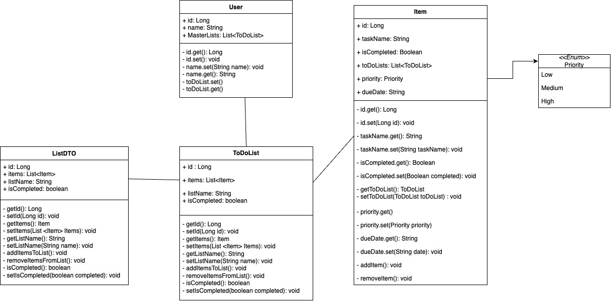
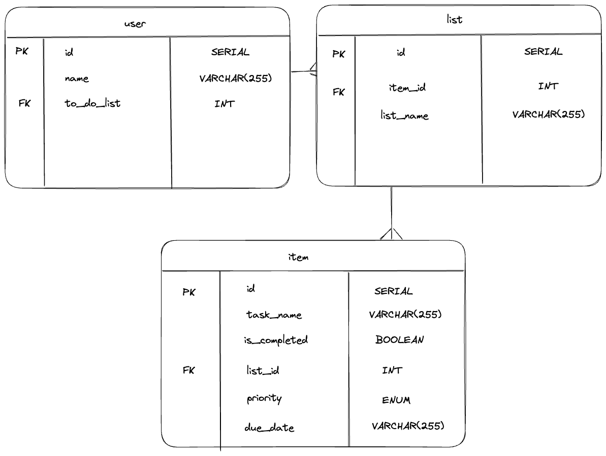

# ToDo-OrNot-ToDo - "Better than Notion"

### Summary:
This project outlines the backend code of a to-do list, designed to be used for everyday activities.
The languages and technologies that we used are: Java, Spring Boot, postgreSQL, IntelliJ, PostMan and Postico.

### Description:
This application will allow a user to create a list and populate their list with items that they need to complete.

## UML and ERD:
### UML diagram: 

### ERD diagram:

### Dummy data:

## Installation instructions:
Users of the application will need the following:
- IntelliJ - with Maven and Java17
  - IntelliJ will need following dependencies to run the application:
    - Spring Boot DevTools
    - Spring Web 
- Postman
- Postico

## Running our To-Do List application:
* In your computer terminal, run the following line: `createdb todolist_db`
  * In resources.application.properties, copy in the following:
    * `spring.datasource.url=jdbc:postgresql://localhost:5432/todolist_db
      spring.datasource.username=
      spring.datasource.password=
      spring.datasource.driver-class-name=org.postgresql.Driver
      spring.jpa.hibernate.ddl-auto=create-drop
      spring.jpa.properties.hibernate.enable_lazy_load_no_trans=true`
* Once you have installed all the necessary applications and dependencies for this project, run the application on IntelliJ and ensure there are no errors.
* In Postico, check that the database has been populated, according to the data created in the dataloader.
* You can now send the following requests in Postman, working in the `localhost:8080` port:

| Action                               | Request type | Request Path                                     | Request Body Required and Example Request Bodies                                                        |    
|--------------------------------------|--------------|--------------------------------------------------|---------------------------------------------------------------------------------------------------------|
| GetAllList                           | Get          | `/lists`                                         |                                                                                                         |
| GetListById                          | Get          | `/list/{id}`                                     |                                                                                                         |
| CreateNewList                        | Post         | `/lists`                                         | ✅ :    `{ "listName" :  "Gifts", "isCompleted" : "false","itemIds" : [2],"userIds" : [1]}`          |
| UpdateList                           | Put          | `/list/{id}`                                     | ✅ :   `{ "listName" :  "Gifts", "isCompleted" : "false","itemIds" : [2],"userIds" : [1]}`           |
| DeleteList                           | Delete       | `/list/{id}`                                     |                                                                                                         |
| SetListToComplete                    | Patch        | `/list/{id}?complete=true`                       |                                                                                                         |
| GetAllItems                          | Get          | `/items`                                         |                                                                                                         |
| FilteringItemsByPriorityOrCompletion | Get          | `items?completion={Boolean}&priority={Priority}` |                                                                                                         |
| GetItemsByID                         | Get          | `/items/{id}`                                    |                                                                                                         |
| AddNewItem                           | Post         | `/items`                                         | ✅ :    `{"taskName" : "eggs", "dueDate" : "2022-06-23", "priority": "HIGH", "isCompleted" : false}` |
| UpdateItem                           | Put          | `/items/{id}`                                    | ✅ :    `{"taskName" : "eggs", "dueDate" : "2022-06-23", "priority": "HIGH", "isCompleted" : false}` |
| DeleteItem                           | Delete       | `/items/{id}`                                    |                                                                                                         |
| SetItemToComplete                    | Patch        | `/items/{id}?complete=true`                      |                                                                                                         |
| GetAllUsers                          | Get          | `/users`                                         |                                                                                                         |
| GetUserById                          | Get          | `/users/{id}`                                    |                                                                                                         |
| GetUserByName                        | Get          | `/users/by-name/{name}`                          |                                                                                                         |
| AddNewUsers                          | Post         | `/users`                                         | ✅ :   `{"name" : "Tim"}`                                                                            |
| UpdateUser                           | Put          | `/users/{id}`                                    | ✅ :   `{"name" : "Tim"}`                                                                            |
| DeleteUser                           | Delete       | `/users/{id}`                                    |                                                                                                         |

## API Description
This section will describe out models and what they will do:

  - Item
    - This represents tasks that would be added to a to-do list
    - Properties of 'Item':
      - Name
      - Due date
      - Priority 
      - isCompleted
      - To-do list
  - ItemDTO 
    - This DTO allows us to use 'Item' without exposing the properties of 'Item'
    - Properties of 'ItemDTO':
        - Name
        - Due date
        - Priority
        - isCompleted
        - List of 'to-do list IDs'
  - List
    - This represents the to-do list, which will be populated with 'Item's
    - Properties of 'List':
  - ListDTO
    - This DTO allows us to use 'List' without exposing the properties of 'List'
    - Properties of 'ListDTO':
  - User
    - This represents the user that will be allocated to a list/
    - Properties of 'User':
      - Name
  - UserDTO
    - This DTO allows us to use 'User' without exposing the properties of 'User'
    - Properties of 'UserDTO':
      - Name
      - List of 'to-do list IDs'
  - Priority(Enum)
    - This enum represents the different priority levels of the 'Item'
    - Constants:
      - HIGH
      - MEDIUM 
      - LOW

## Aspirational Extensions 
If we had more time we would try to implement the following functionality:
* Filtering the to-do lists by due date

## Quirks and/or bugs
One quirk of our application is the 'Reminder' functionality; '@Scheduled' annotation takes in a time and  
when that time has come, the application will remind the user that a specific task needs to be done.

## Coders
- Hayan 
- Vincent 
- Rada 
- Maryan

