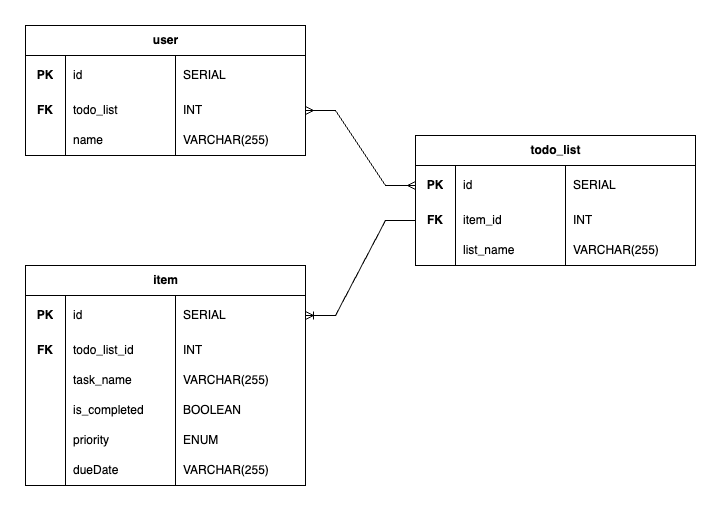

# ToDo-OrNot-ToDo - "Better than Notion"

### Summary:
This project outlines the backend code of a to-do list, designed to be used for everyday activities. 
The motivation behind this project is that it's so hard to be organised these days when there's so much to do in so little time.
So we decided to make a world-class to-do list application to help everyone get their lives together (because obviously no app of the sort exists already).
By using our API you can organise all types of tasks into suitable lists and utilise them to manage your day-to-day life.

## Diagrams:
The following diagrams show the relationships and attributes of the models in the project.
### UML diagram:

### ERD diagram:

### Dummy data:

## Relationships
In this project there are one-to-many and many-to-many relationships:
* Many users to many lists
* One list to many items

## API Description
This API will allow multiple users to create lists which can then be populated with items that they need to complete.
This section will describe out models and what they will do:

### User  
This represents the users that can be added, removed and managed in the database. The users will be allocated to lists.
- Properties of 'User':
    - name - string that represents the user's name
    - masterList - a list of toDoLists

### UserDTO  
This Data Transfer Object class allows us to use 'User' without exposing the properties of 'User'. It is used for transferring data between layers of the application.
- Properties of 'UserDTO':
    - name - string that represents the user's name
    - listIds - list of 'to-do list IDs'

### ToDoList:  
This represents the to-do list which will be populated with multiple 'Item's.
- Properties of 'List':
  - listName - string that represents the list's name
  - isCompleted - boolean that represents the completion status (completed or not)
  - users - list of User objects
  - items - list of Item objects

### ListDTO:  
This Data Transfer Object class allows us to use 'List' without exposing the properties of 'List'. It is used for transferring data between layers of the application.
- Properties of 'ListDTO':
  - listName - string that represents the list's name
  - itemIds - list of Item IDs
  - userIds - list of User IDs

### Item:  
This represents tasks that would belong to a to-do list.
- Properties of 'Item':
  - taskName - string that represents the item's name
  - dueDate - string that represents the item's due date
  - priority - enum that represents the item's priority
  - isCompleted - boolean that represents the completion status (completed or not)
  - To-do list - the list object that this item is assigned to

### ItemDTO:  
This Data Transfer Object class allows us to use 'Item' without exposing the properties of 'Item'. It is used for transferring data between layers of the application.
- Properties of 'ItemDTO':
    - taskName - string that represents the item's name
    - dueDate - string that represents the item's due date 
    - priority - enum that represents the item's priority
    - isCompleted - boolean that represents the completion status (completed or not)  
    - listId - id of the list the item is assigned to

### Priority(Enum)  
This enum represents the different priority levels that an 'Item' can have.
- Constants:
    - HIGH
    - MEDIUM
    - LOW

## Tech Stack
- IntelliJ IDEA (JDK 17)
- PostgresSQL
- Postico
- Postman
- Spring Boot

## Dependencies:
IntelliJ will need following dependencies to run the application:
  - Spring Data JPA
  - Spring Boot DevTools
  - Spring Web

## SetUp Instructions
Users of the application will need to do the following:
1. Ensure that the following are installed on your machine:
   - IntelliJ (JDK 17) - with Maven
   - PostgresSQL
   - Postman
   - Postico
2. Clone the repository from GitHub. To do this, at the top of the page, click on the green Code button. Make sure that SSH is selected and then copy the link provided. Then within your terminal, enter the following command:
    <pre><code> git clone git@github.com:R08K09/BNTA_BackEnd_Project.git </code></pre>
3. Create a new database by running the following line anywhere in your terminal: `createdb todolist_db`
   * In resources.application.properties, copy in the following:
     <pre><code>spring.datasource.url=jdbc:postgresql://localhost:5432/todolist_db
     spring.datasource.username=
     spring.datasource.password=
     spring.datasource.driver-class-name=org.postgresql.Driver
     spring.jpa.hibernate.ddl-auto=create-drop
     spring.jpa.properties.hibernate.enable_lazy_load_no_trans=true </code></pre>
4. Once you have installed all the necessary applications and dependencies for this project, run the BackendCodeApplication via Intellij IDEA. Ensure that there are no errors and that the API is running on port 8080.
5. In Postico, check that the database has been populated, according to the data created in the DataLoader.
6. Via Postman, create a new collection called ToDo List Project and add the following requests in Postman.

## PostMan Instructions
All request URLs will start with the following:
`http://localhost:8080...`
To perform a specific request, add the request path Endpoint to the URL.

Example URL: `http://localhost:8080/lists`

For any request that requires a Request Body to input required details, the request body must be in JSON format in the raw body section. 

| Action                               | Method | Request Path (Endpoint)                          | Request Body Required and Example Request Bodies                                                                               | Expected return from Postman                                                                                                                                                                                                                   |  
|--------------------------------------|:------:|--------------------------------------------------|--------------------------------------------------------------------------------------------------------------------------------|------------------------------------------------------------------------------------------------------------------------------------------------------------------------------------------------------------------------------------------------|
| GetAllLists                          |  Get   | `/lists`                                         |                                                                                                                                | This endpoint should return all the lists from the DataLoader, including the users, that own that list, and the items included in that list.                                                                                                   |
| FilteringListsByCompletion           |  Get   | `/lists?completed={Boolean}`                     |                                                                                                                                | This endpoint should return the lists based on whether they are completed or not, i.e. if the endpoint is `completed=true`, Postman will return all the lists which have been completed.                                                       |
| GetListById                          |  Get   | `/lists/{id}`                                    |                                                                                                                                | This endpoint should return the list of the ID that has been passed in, with the items contained in that list and the users who own that list.                                                                                                 |
| CreateNewList                        |  Post  | `/lists`                                         | ✅ :   `{"listName" : "Gifts",`  `"isCompleted" : "false",`  `"itemIds" : [2],`  `"userIds" : [1]}`             | This endpoint should post a new item, which can be viewed either in Postico, or using the GetAllLists or GetListsByID endpoints.                                                                                                               |
| UpdateList                           | Patch  | `/lists/{id}`                                    | ✅ :   `{"listName" : "Gifts",`  `"isCompleted" : "false",`  `"itemIds" : [2],`  `"userIds" : [1]}`             | This endpoint should allow you to update a property of a specific list, and this change can be viewed in Postico or using the GetAllLists or GetListById endpoints.                                                                            |
| SetListCompletion                    | Patch  | `/lists/complete/{id}?completed={Boolean}`       |                                                                                                                                | This endpoint should allow you to update the isComplete property of a to-do list, and this change can be viewed through Postico or the following endpoints; GetAllLists, GetListById or FilteringListsByCompletion.                            |
| DeleteList                           | Delete | `/lists/{id}`                                    |                                                                                                                                | This endpoint should allow you to delete a list, based on the ID, which can be viewed in Postico or using the GetAllLists or GetListById endpoints. When the list is deleted, so are the items within that list.                               |
| GetAllItems                          |  Get   | `/items`                                         |                                                                                                                                | This endpoint should return all the items from the DataLoader, including the to-do list they are in and the users who own those lists.                                                                                                         |
| FilteringItemsByPriorityOrCompletion |  Get   | `/items?completed={Boolean}&priority={Priority}` |                                                                                                                                | This endpoint should return items based on their completion status and/or their priority i.e. if the endpoint is `completed=true` and `priority=HIGH`, Postman will return all the items which have been completed and are of `HIGH` priority. |
| GetItemsByID                         |  Get   | `/items/{id}`                                    |                                                                                                                                | This endpoint should return the item based on their ID, including the to-do list they are in and the users who own those lists.                                                                                                                |
| CreateNewItem                        |  Post  | `/items`                                         | ✅ :    `{"taskName" : "eggs",`  ` "dueDate" : "2022-06-23",`   `"priority": "HIGH",`  `"isCompleted" : false}` | This endpoint should allow you to post a new item, which can be viewed either in Postico, or using the GetAllItems or GetItemsByID endpoints.                                                                                                  |
| UpdateItem                           | Patch  | `/items/update/{id}`                             | ✅ :    `{"taskName" : "eggs",`  ` "dueDate" : "2022-06-23",`   `"priority": "HIGH",`  `"isCompleted" : false}` | This endpoint should allow you to update a property of a specific item, and this change can be viewed in Postico or using the GetAllItems or GetItemById endpoints.                                                                            | 
| SetItemCompletion                    | Patch  | `/items/{id}?completed=true`                     |                                                                                                                                | This endpoint should allow you to update the isComplete property of an item, and this change can be viewed through Postico or the following endpoints; GetAllItems, GetItemById or FilteringItemsByPriorityOrCompletion.                       |
| DeleteItem                           | Delete | `/items/{id}`                                    |                                                                                                                                | This endpoint should allow you to delete a item, based on the ID, which can be viewed in Postico or using the GetAllItems or GetItemById endpoints.                                                                                            |
| GetAllUsers                          |  Get   | `/users`                                         |                                                                                                                                | This endpoint should return all the users from the DataLoader, including the lists that the users own and the items included in that list.                                                                                                     |
| GetUserById                          |  Get   | `/users/{id}`                                    |                                                                                                                                | This endpoint should return the user based on their ID, including the lists that the users own and the items included in that list.                                                                                                            |
| GetUserByName                        |  Get   | `/users/by-name/{name}`                          |                                                                                                                                | This endpoint should return the user based on their name, including the lists that the users own and the items included in that list.                                                                                                          |
| CreateNewUsers                       |  Post  | `/users`                                         | ✅ :   `{"name" : "Tim"}`                                                                                                   | This endpoint should post a new user, which can be viewed either in Postico, or using the following endpoints; GetAllUsers, GetUseRByID or GetUserByName endpoints.                                                                            |
| UpdateUser                           | Patch  | `/users/{id}`                                    | ✅ :   `{"name" : "Tim"}`                                                                                                   | This endpoint should allow you to update a property of a specific user, and this change can be viewed in Postico or using the following endpoints; GetAllUsers, GetUseRByID or GetUserByName endpoints.                                        |
| RemoveListFromUser                   | Patch  | `/remove-list/{id}/{listId}`                     |                                                                                                                                | This endpoint should allow you to remove a list that is currently assigned to a user, based on the IDs of the list and user.                                                                                                                   |
| DeleteUser                           | Delete | `/users/{id}`                                    |                                                                                                                                | This endpoint should allow you to delete a user, based on their ID. If that user is the only person that is assigned to the list, the list and the items within the list are also deleted.                                                     |

Note: GET methods to read data, POST methods to create data, PUT/PATCH methods to update data, DELETE method to delete data.

## Quirks
One quirk of our application is the 'Reminder' functionality; '@Scheduled' annotation allows for a function of be run at
a specific time or at specific intervals. 

Currently, the item reminder function is to set to run every day at 9:00am. When the function runs it checks if the current local date is equal to any of the "dueDate" of any items currently in the database, if the current date and dueDate match it will print the task name to the console, reminding the user that a specific task needs to be done.

In the future this function could be built upon to create push notifications to send to the user.

## Aspirational Extensions
If we had more time we would try to implement the following functionality:
* Filtering the to-do lists by due date
* Having an enum for list topic

## Collaborators
- Vincent - (GitHub: [dir-V](https://github.com/dir-V))
- Rada - (GitHub: [R08K09](https://github.com/R08K09))
- Hayan - (GitHub: [HayanButt](https://github.com/HayanButt))
- Maryan - (GitHub: [maryan-axmed](https://github.com/maryan-axmed))

